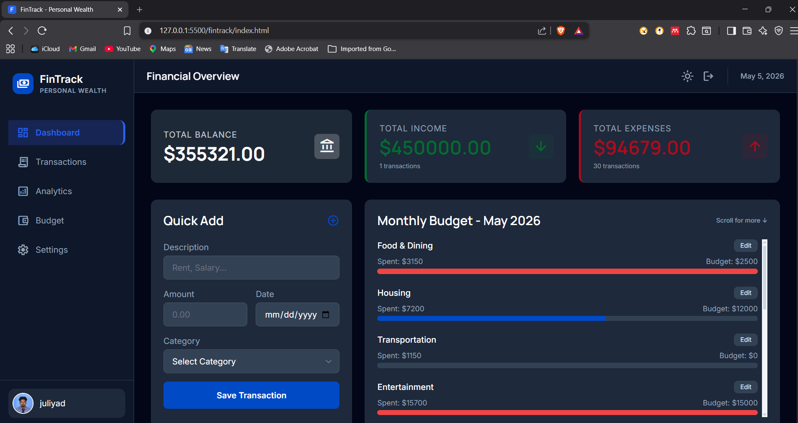
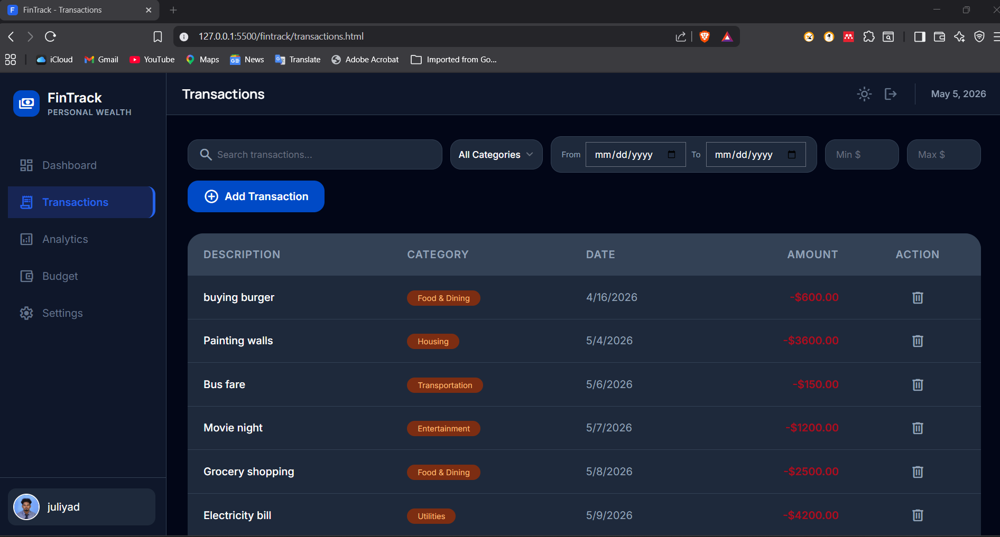
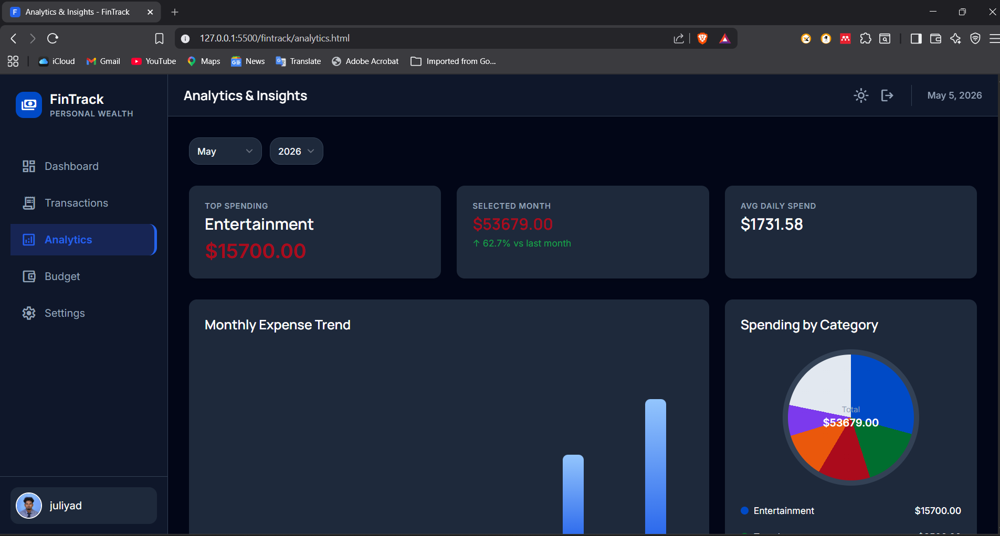
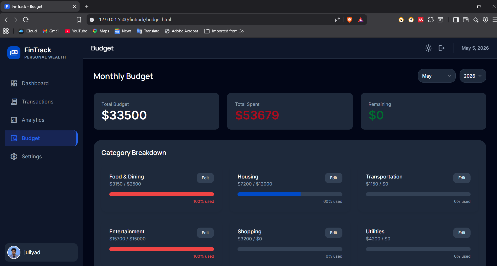
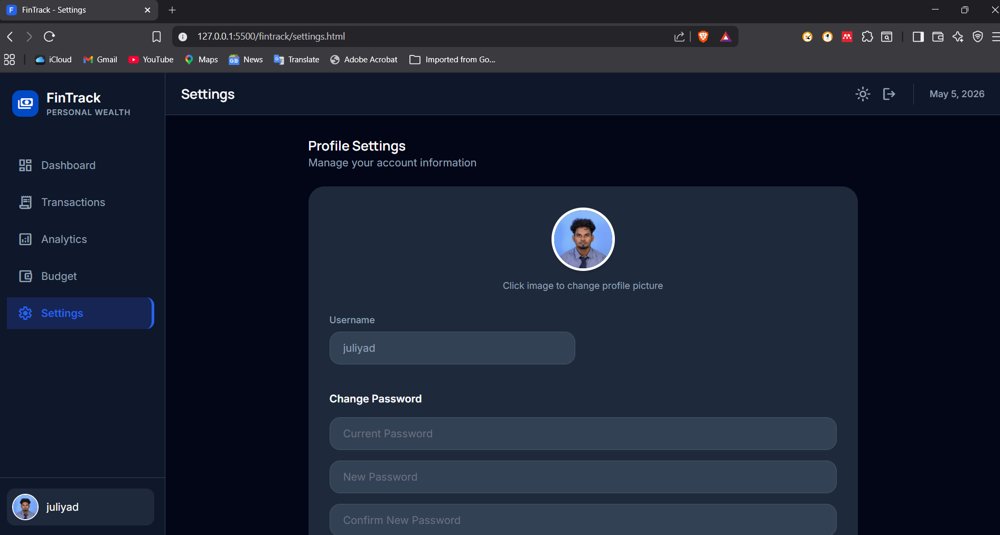
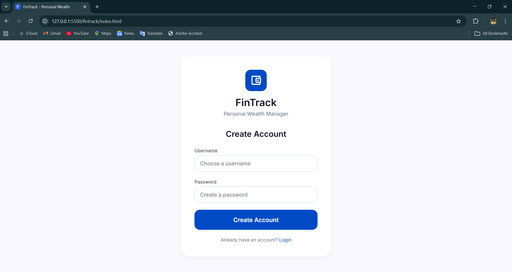

# 💰 FinTrack – Expense Tracking Web App

FinTrack is a simple, intuitive **client-side expense tracking application** built using **HTML, CSS, and JavaScript**. It helps users manage income and expenses, track financial balance, and gain insights into spending habits — all directly in the browser with no backend required.

---

## 🌐 Live Demo

🔗 https://s-n-juliyaddinosan.github.io/Fin-Track/

---

## 🚀 Features

* ✅ Add and manage income & expense transactions
* 📋 View a complete transaction history
* 💵 Real-time balance updates
* ❌ Delete transactions بسهولة
* 📊 Basic analytics and budget tracking
* 💾 Persistent data using **localStorage**
* ⚙️ Customizable settings

---

## 🛠️ Tech Stack

* **HTML5** – Application structure
* **CSS3** – Styling and layout
* **JavaScript (Vanilla)** – Logic and interactivity
* **LocalStorage API** – Data persistence

---

## 📂 Project Structure

```
fintrack/
│── index.html          # Dashboard / Home
│── transactions.html   # Manage transactions
│── budget.html         # Budget planning
│── analytics.html      # Financial insights
│── settings.html       # App settings
│── favicon.svg         # App icon
│── README.md           # Project documentation
```

---

## ⚡ Getting Started

### 1. Clone the repository

```bash
git clone https://github.com/S-N-JuliyadDinosan/Fin-Track.git
```

### 2. Navigate to the project folder

```bash
cd Fin-Track
```

### 3. Run the application

Open `index.html` in your browser.

---

## 💡 How It Works

* Users add income and expense entries
* Data is stored in **localStorage**
* The app dynamically updates:

  * Total balance
  * Income vs expenses
* Data persists even after refreshing the browser

---

## 📸 Screenshots








---

## 🎯 Future Improvements

* 🔐 User authentication (JWT / OAuth)
* ☁️ Cloud storage (Firebase / REST API backend)
* 📱 Full mobile responsiveness
* 📈 Advanced charts and reporting
* 🌍 Multi-currency support

---

## 🤝 Contributing

Contributions are welcome!
Feel free to fork the repository and submit a pull request.

---

## 📄 License

This project is licensed under the **MIT License**.

---

## 👨‍💻 Author

**S.N. Juliyad Dinosan**
BSc (Hons) in Software Engineering

🔗 LinkedIn: https://linkedin.com/in/juliyad-dinosan-samuel-nesakumar-a64a52295
📧 Email: [juliyad.samuel@gmail.com](mailto:juliyad.samuel@gmail.com)

---

## 🏷️ Tech Badges


---

## ⭐ Support

If you like this project, consider giving it a ⭐ on GitHub!
